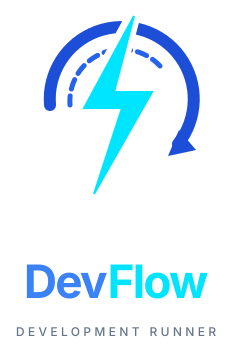

<div align="center">



# DevFlow ⚡

### Native Desktop GUI Companion, Interactive Multi-Target TUI Hub & AI Agent MCP Control Plane

[](https://github.com/cmdworks/devflow/actions/workflows/ci.yml)
[](https://github.com/cmdworks/devflow/releases)
[](https://opensource.org/licenses/MIT)
[](https://www.rust-lang.org)
[](https://modelcontextprotocol.io)
[](https://github.com/cmdworks/devflow)

**DevFlow** bridges native mobile, desktop, and hybrid frameworks into a unified, high-performance developer control plane built in Rust.

🖥️ **Desktop GUI Companion (`devflow-gui`)**: The all-in-one visual cockpit — 1-click build/reload/restart, live split log streaming, and real-time AI Agent MCP telemetry.  
⚡ **Terminal CLI & TUI (`devflow`)**: Keyboard-driven multi-target hub, zero-polling $O(1)$ ring buffer logs, and cross-terminal IPC.

[**Explore Documentation**](docs/getting-started.md) · [**AI Agent Runbook**](docs/ai/agent-workflow.md) · [**MCP Integration**](docs/ai/mcp-integration.md) · [**Report Bug**](https://github.com/cmdworks/devflow/issues)

</div>

---

## ⚡ 1-Line Remote Installation (No Git or Rust Required)

You do **not** need to clone the repository or install Rust to use DevFlow. Choose your installation method below:

### 🌟 1. Desktop GUI Companion (Recommended — Complete Visual Cockpit)

Installs the native `devflow-gui` desktop app for visual multi-target development, 1-click hot reload, and real-time AI Agent MCP telemetry:

```bash
curl -fsSL https://raw.githubusercontent.com/cmdworks/devflow/main/scripts/install-gui.sh | bash
```

### 📦 2. Complete Suite (Desktop GUI + Terminal CLI & TUI)

Installs both the `devflow-gui` companion app and the `devflow` terminal command:

```bash
curl -fsSL https://raw.githubusercontent.com/cmdworks/devflow/main/scripts/install.sh | bash
```

### ⌨️ 3. Terminal CLI & TUI Only

Installs the `devflow` command-line runner and interactive terminal hub:

```bash
curl -fsSL https://raw.githubusercontent.com/cmdworks/devflow/main/scripts/install-cli.sh | bash
```

> [!TIP]
> The remote install scripts automatically detect your operating system (macOS / Linux) and CPU architecture (Apple Silicon `arm64`, Intel `x86_64`), download the latest precompiled release, install into `~/.local/bin`, and **automatically clear macOS Gatekeeper quarantine flags**.

---

## 📥 Direct Downloads from GitHub Releases

If you prefer to download pre-built binaries manually, visit the **[GitHub Releases Page](https://github.com/cmdworks/devflow/releases)**:

| Platform | Architecture | 🌟 Desktop GUI Companion (Recommended) | Terminal CLI Download |
| :--- | :--- | :--- | :--- |
| **macOS** | Apple Silicon (`arm64` / M1–M4) | [devflow-gui-macos-arm64.tar.gz](https://github.com/cmdworks/devflow/releases/latest/download/devflow-gui-macos-arm64.tar.gz) | [devflow-cli-macos-arm64.tar.gz](https://github.com/cmdworks/devflow/releases/latest/download/devflow-cli-macos-arm64.tar.gz) |
| **macOS** | Intel 64-bit (`x86_64`) | [devflow-gui-macos-x86_64.tar.gz](https://github.com/cmdworks/devflow/releases/latest/download/devflow-gui-macos-x86_64.tar.gz) | [devflow-cli-macos-x86_64.tar.gz](https://github.com/cmdworks/devflow/releases/latest/download/devflow-cli-macos-x86_64.tar.gz) |
| **Linux** | x86_64 (`amd64`) | [devflow-gui-linux-x86_64.tar.gz](https://github.com/cmdworks/devflow/releases/latest/download/devflow-gui-linux-x86_64.tar.gz) | [devflow-cli-linux-x86_64.tar.gz](https://github.com/cmdworks/devflow/releases/latest/download/devflow-cli-linux-x86_64.tar.gz) |
| **Linux** | ARM64 (`aarch64`) | *(GUI coming soon)* | [devflow-cli-linux-aarch64.tar.gz](https://github.com/cmdworks/devflow/releases/latest/download/devflow-cli-linux-aarch64.tar.gz) |

---

## 🍎 macOS Gatekeeper & Quarantine Bypass (`xattr -cr`)

> [!IMPORTANT]
> Because DevFlow release binaries are not yet notarized with an Apple Developer ID, macOS Gatekeeper may display a security dialog stating that *"DevFlow cannot be opened because the developer cannot be verified"*.

If you downloaded the binary manually or receive a Gatekeeper warning, run `xattr -cr` in your terminal to strip the quarantine attribute:

```bash
# For installed binaries in ~/.local/bin
xattr -cr ~/.local/bin/devflow-gui
xattr -cr ~/.local/bin/devflow

# For binaries in your current directory or Downloads
xattr -cr ./devflow-gui
xattr -cr ./devflow
xattr -cr ~/Downloads/devflow*
```

---

## 🛠️ For Developers & Contributors (Building from Source)

If you are developing or contributing to DevFlow itself:

```bash
# Clone the repository
git clone https://github.com/cmdworks/devflow.git
cd devflow

# Build and link locally
./scripts/install.sh

# Or run fast incremental development wrappers (<0.1s)
./bin/gui-dev   # Launches Desktop GUI in dev mode with live reload
./bin/cli-dev [command] # Runs CLI commands instantly
```

---

## ✨ Why DevFlow?

Developing modern multi-target applications (e.g. an Android companion app alongside a native macOS desktop utility and a React Native frontend) usually means juggling dozens of fragmented CLI commands, heavy background watchers, and Python scripts that leak memory.

**DevFlow gives you a single, unified developer experience:**
- **🖥️ Native Desktop GUI Companion**: Full visual dashboard that handles **both** multi-target builds/reloads and live AI Agent MCP activity telemetry.
- **🎯 Zero-Config Multi-Target TUI Hub**: Launch `devflow` in your terminal with zero arguments. It auto-discovers all runnable projects, connected hardware devices, and running sessions.
- **⚡ Ultra-Lean Performance (< 6.5 MB RSS)**: Circular $O(1)$ ring buffers and kernel-level file watchers (`kqueue` / `inotify`) consume **98% less RAM and ~0.1% CPU** compared to traditional Python dev scripts.
- **🤖 Built-in Agent-Aware MCP Server**: Full Model Context Protocol server over Stdio & HTTP with Bearer Auth, enabling AI coding agents (**Claude Desktop**, **Cursor**, **Google Antigravity**, **VS Code**) to build, reload, inspect logs, and debug applications.
- **🔄 Cross-Terminal Session Sync & IPC**: Run `devflow reload` or `devflow restart` from any terminal window to hot-reload your active build process across process boundaries.
- **📱 True Multi-Platform Support**: Native runners for **Android** (Kotlin / Java / Gradle), **macOS / iOS** (Swift / SwiftPM / Xcode), **Flutter**, **React Native**, and **Tauri**.
- **🩺 Instant Health Diagnostics (`devflow doctor`)**: Comprehensive verification of SDKs, toolchains (`adb`, `xcodebuild`, `simctl`, `swift`, `gradle`), and project configuration.

---

## 🖥️ Desktop GUI Companion (The All-in-One Visual Cockpit)

The **DevFlow Desktop GUI Companion (`devflow-gui`)** provides a centralized control station combining visual target execution and real-time AI Agent observability:

```bash
devflow-gui
```

```
┌─────────────────────────────────────────────────────────────────────────────────────────────┐
│ ⚡ DevFlow Desktop Companion             [ 🟢 Connected: 1 Session ]  [ 🤖 4 MCP Traces ]  │
├───────────────────┬──────────────────────────────────────────┬──────────────────────────────┤
│ 🎯 TARGETS        │ 📋 LIVE TERMINAL & LOGS                 │ 🤖 MCP INSPECTOR             │
│                   │                                          │                              │
│ ▶ mobile-android  │ [14:22:01] [I] [App] Session initialized │ Agent: [ Cursor ]            │
│   desktop-macos   │ [14:22:03] [D] [Gradle] Build 100%       │ Tool : devflow_get_logs      │
│   web-client      │ [14:22:04] [I] [Vite] HMR connected      │ Status: 200 OK (12ms)        │
│                   │ [14:22:08] [W] [Audio] Buffer underrun   │ 📥 Input: {"lines": 50}      │
│ [▶ Run] [🔄 HMR]  │ ──────────────────────────────────────── │ 📤 Output: {"entries": 50}   │
│ [🔁 Restart]      │ [Level: ALL] [Tag: App] [Auto-Scroll:ON] │ [Session: cursor-9bda] [🗑️]  │
└───────────────────┴──────────────────────────────────────────┴──────────────────────────────┘
```

### 🚀 What the Desktop GUI Does:
1. **Interactive Target Management**: 1-click **Build**, **Launch**, **Hot-Reload (HMR)**, **Restart**, and **Stop** for Android, iOS/macOS, Flutter, React Native, and Tauri targets.
2. **Live Split-Pane Terminal & Log Stream**: Real-time $O(1)$ ring-buffered logs with severity filtering (`Error`, `Warning`, `Info`, `Debug`), tag filtering, and instant search.
3. **Live AI Agent MCP Telemetry**:
   - Live activity stream of all tool calls made by **Claude Desktop**, **Cursor**, **Google Antigravity**, and **VS Code**.
   - Dual-payload JSON inspector displaying both input arguments (`📥`) and tool responses (`📤`).
   - Branded agent filter chips and session dropdowns showing tool counts and last-used actions.
   - 2-step inline safe trace deletion with a 4-second confirmation timer.

---

## 🎯 Interactive TUI Hub (Terminal Experience)

Run `devflow` with zero arguments inside any workspace:

```bash
devflow
```

```
┌ DevFlow ⚡ Hub ────────────────────────────────────────────────────────┐
│ [1] Targets     [2] Active Sessions (1)    [3] Devices (3)            │
├─────────────────────────────────────────────────────────────────────────┤
│ ▶ [1] mobile-android  (Kotlin / Gradle)                                 │
│   [2] desktop-macos   (Swift / SwiftPM)                                 │
│   [3] web-client      (Vite / React)                                    │
│                                                                         │
│ Target Details: mobile-android                                          │
│   Platform : Android (JVM 17)                                           │
│   Device   : Samsung Galaxy A35 (Physical USB)                          │
│   State    : IDLE (Press 's' to start live runner)                      │
├─────────────────────────────────────────────────────────────────────────┤
│ [1-9] Switch Tab | [s] Start/Stop | [r] Reload | [R] Restart | [q] Quit │
└─────────────────────────────────────────────────────────────────────────┘
```

### ⌨️ Keyboard Shortcuts

| Shortcut | Action |
| :--- | :--- |
| `1` – `9` / `Tab` | Switch between tabs and targets |
| `↑` / `↓` (`k` / `j`) | Navigate items (targets, sessions, devices) |
| `s` / `Enter` | Start or stop selected target runner |
| `a` | Start all discovered targets simultaneously |
| `r` | Trigger framework-aware hot reload (HMR / VM reload) |
| `R` | Trigger full application restart (kill + rebuild + relaunch) |
| `f` | Toggle auto-follow log stream |
| `Esc` / `q` | Return to Hub / Quit |

---

## 🤖 AI Coding Agent & MCP Integration

DevFlow is fully **Agent-Aware** and exposes **11 native Model Context Protocol (MCP)** tools.

### 1-Click Auto-Configuration

Automatically configure your AI assistant configuration files with a single command:

```bash
devflow mcp connect all
```

| AI Assistant | Config Location | Setup Guide |
| :--- | :--- | :--- |
| **Google Antigravity** | `~/.gemini/antigravity-ide/mcp_config.json` | `devflow mcp connect antigravity` |
| **Claude Desktop** | `~/Library/Application Support/Claude/claude_desktop_config.json` | `devflow mcp connect claude` |
| **Cursor IDE** | `.cursor/mcp.json` or `~/.cursor/mcp.json` | `devflow mcp connect cursor` |
| **VS Code / Roo-Code** | `.vscode/mcp.json` | `devflow mcp connect vscode` |

### Querying Logs & Traces from CLI:

```bash
# Filter logs by AI agent
devflow mcp logs --agent claude

# Filter logs by active session
devflow mcp logs --session cursor-9bda175f

# Inspect full input parameters and output responses
devflow mcp logs --limit 5 --full
```

👉 **[Read the Full MCP Integration Guide](docs/ai/mcp-integration.md)**  
👉 **[Read the AI Agent Operational Runbook](docs/ai/agent-workflow.md)**

---

## 🛠️ CLI Command Reference

| Command | Description |
| :--- | :--- |
| `devflow` | Opens the interactive multi-target TUI Hub |
| `devflow init` | Scaffold `devflow.toml` for the current workspace |
| `devflow doctor` | Run environment, SDK, toolchain, and project health diagnostics |
| `devflow devices` | Discover connected hardware devices, AVDs, and iOS simulators |
| `devflow dev [target]` | Start live development session (build → install → launch → logs → watch) |
| `devflow build [target]` | Perform one-off build with optional `--release` and `--json` |
| `devflow logs` | Stream live device logs (`--follow`, `--level`, `--tag`, `--query`) |
| `devflow reload` | Signal active session to hot-reload from any terminal |
| `devflow restart` | Signal active session to perform a full app restart |
| `devflow mcp serve` | Start Model Context Protocol server (stdio or `--http --port 9090`) |
| `devflow mcp logs` | Query, filter, and inspect SQLite MCP access logs and traces |
| `devflow mcp connect` | Auto-configure MCP for Claude, Cursor, Antigravity, or VS Code |

---

## 📊 Performance Benchmarks

Measured during continuous log streaming and file watching on physical hardware (**Samsung Galaxy A35**):

| Metric | DevFlow (Rust) | Legacy Python Dev Scripts | Advantage |
| :--- | :--- | :--- | :--- |
| **Memory Footprint (RSS)** | **5.07 MB – 6.22 MB** (flat line) | **140 MB – 300 MB** | **22.5x to 27x leaner** |
| **CPU Utilization** | **0.0% – 0.1%** | **3.5% – 8.0%** idle; 4–12% active | **~40x lower CPU churn** |
| **Log Buffer Strategy** | $O(1)$ Bounded Circular Buffer | Unbounded string list | Zero heap exhaustion |
| **File Watching** | Kernel `kqueue` / `FSEvents` (0% CPU) | `os.walk` polling loop every 1s | Instant, zero overhead |

---

## 📚 Documentation Sitemap

- 📖 [**Getting Started Guide**](docs/getting-started.md) — Prerequisites, installation, TUI guide, and desktop GUI walkthrough.
- 🏛️ [**Architecture & Engine Design**](docs/architecture.md) — Crate taxonomy, ring buffer internals, IPC sockets, and framework adapters.
- 🤖 [**AI Agent Runbook**](docs/ai/agent-workflow.md) — Operational manual for autonomous AI agents driving DevFlow.
- 🔌 [**MCP Integration Reference**](docs/ai/mcp-integration.md) — Complete 11-tool catalog, schemas, and SQLite WAL logging.
- 🗺️ [**Repository Map & Conventions**](docs/ai/repository-map.md) — Symbol index, concurrency patterns, and testing guidelines for AI contributors.

---

## 🔄 Automated CI & Manual Release Trigger

DevFlow includes GitHub Actions workflows for continuous integration and automated multi-platform releases:

- **Continuous Integration (`.github/workflows/ci.yml`)**: Runs on every push and pull request (`cargo fmt`, `cargo clippy`, `cargo check`, `cargo test`).
- **Release Workflow (`.github/workflows/release.yml`)**:
  - **Git Tag Trigger**: Push any version tag (`git tag v0.1.0 && git push origin v0.1.0`).
  - **Manual Trigger (`workflow_dispatch`)**: Go to **Actions** → **Release** → **Run workflow** in the GitHub web interface and enter the desired release version tag (e.g. `v0.1.0`).
  - Generates release binaries and SHA256 checksums for **macOS arm64**, **macOS x86_64**, **Linux x86_64**, and **Linux arm64**.

---

## 🤝 Contributing & Welcome

We welcome contributions, bug reports, framework adapters, and documentation improvements from everyone!

1. Fork the repository and create a feature branch (`git checkout -b feature/my-new-feature`).
2. Verify all checks pass:
   ```bash
   cargo fmt --all -- --check
   cargo clippy --workspace --all-targets -- -D warnings
   cargo test --workspace
   ```
3. Commit your changes and open a Pull Request.

---

## 📄 License

This project is licensed under the [MIT License](LICENSE).

Copyright (c) 2026 DevFlow Contributors.
